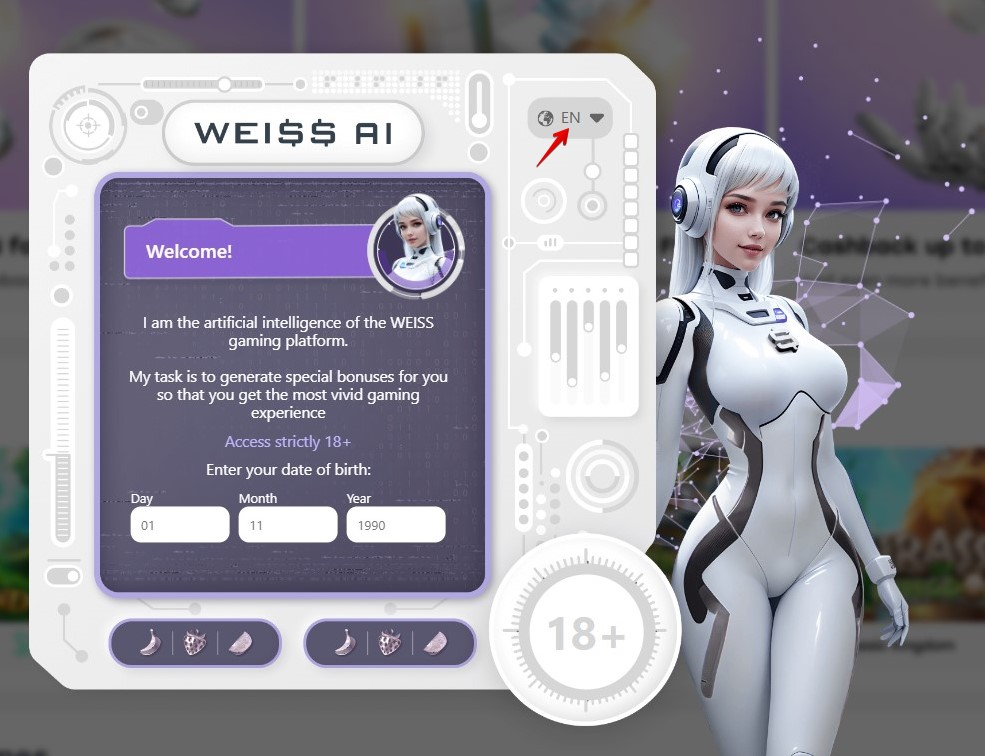

# AI form

It's an app built with React, HTML, CSS and JS. It allows users to fill out a multilingual AI-designed form.

### Installation

To install the application, follow these steps:

Clone the repository to your local machine.
Open a terminal and navigate to the root directory of the project.
Run npm install to install the dependencies.
Run npm start to start the development server.
Open http://localhost:3000 in your browser.
